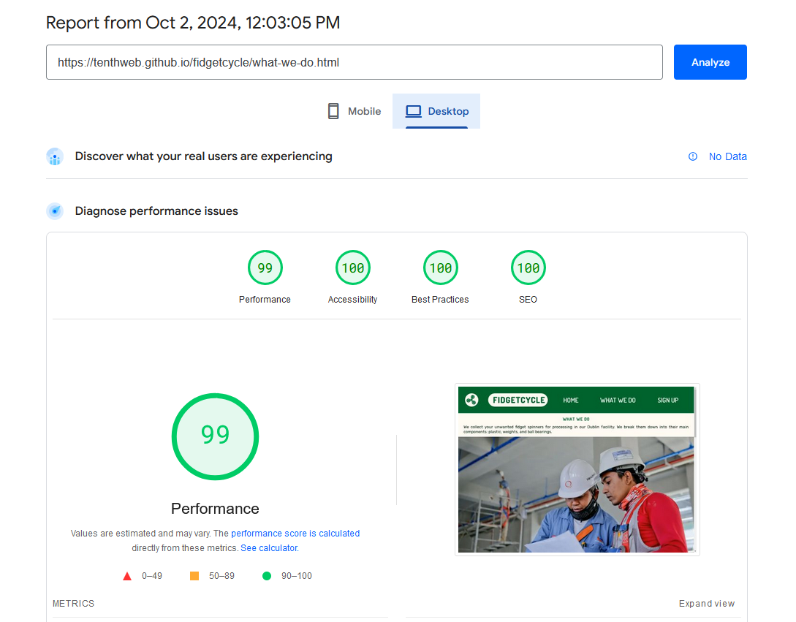
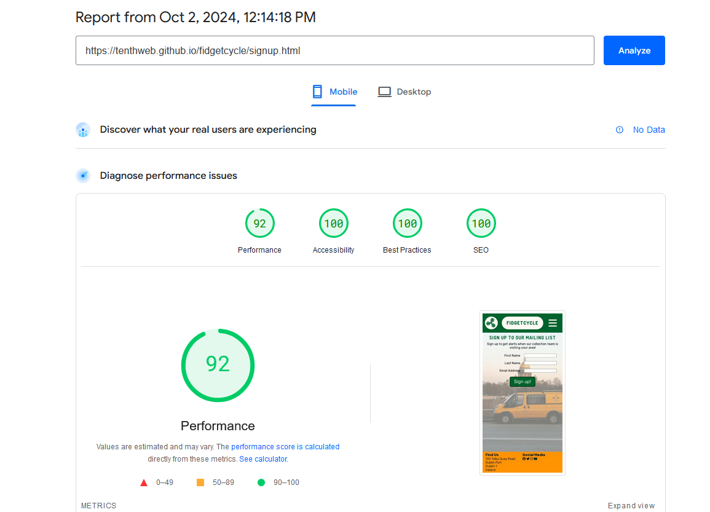
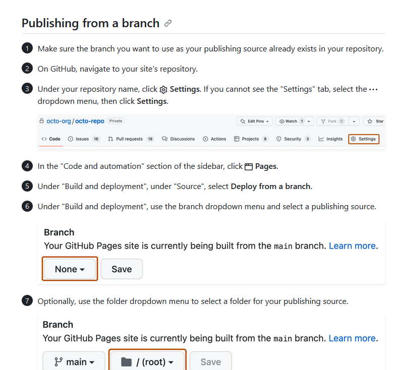

# FidgetCycle

The FidgetSpinner website is intended for owners of fidget spinners who don't want them any more. Its purpose is to inform them about the FidgetSpinner business and convince them to sign up to the mailing list, with the ultimate aim of allowing them to donate their unwanted fidget spinners.

Users will be able to find information about the purpose of the business and the value provided by donating.

## Features

### Header 

* The top of the page is a header with the company logo and branding.
* Navigation links to the site's pages are right at the top of the page in a fixed header, making it easy to access them at any time while using the site.
* The navigation links are in the same font and colours chosen for the branding, and contrast with the background.

#### Navigation on Mobile

* A "hamburger" icon shows the navigation links in a drop down menu when clicked.

    

#### Navigation on Larger Screens

* On larger screens, the extra space makes it more appropriate to use links in the header itself rather than a drop down menu. Again, this keeps the links to the site's pages very easy to access.

### Footer

* The footer contains contact information and links to social media pages. This allows the user to get this information from any page.
* Because this information is lower in priority than the header links, the footer isn't fixed, but is at the bottom of each page.

### Home page

* The home page has a concise description of the business, and a call to action in the form of a "Sign up here!" button. The description benefits the user by explaining the business without overloading, and the button has the benefit of allowing them to click to the signup page in an intuitive progression.

    

### "What We Do" Page

* The "What We Do" Page explains how the business works, and the different ways the recycled products can be used. This page can overcome barriers to signing up by answering questions a user might have about what the business is.

    
    

### Signup Page

* The signup page is a simple form with fields for first name, last name, and email address. In this version of the site, the completed for goes to the CI form dump.

    

## Testing
* I tested that the pages work in different browers: Chrome, Firefox, Safari, and Edge.
* I checked that that the page is responsive and functions as expected on all screen sizes using the the Firefox "inspect element" tools, and tested on Samsung and iPhone hardware.
* I confirmed that all content was readble, understandable, and placed as intended in the pages' flow.
* I confirmed that the form works as intended ands requires the correct input types.

### Bugs
* Several bugs were found in the header and were fixed before the main round of testing:
    * The logo and page heading were not changing size responsively. This was fixed by changing font-size, max-width, and positions of the relevant elements and adjusting the media queries.
    * A bug was found where the footer would leave a blank gap underneath it on mobile browsers with an adjustable search bar. This was fixed by changing the structure of the header, main, and footer to make more use of flexboxes.
    * Loading times were slow on mobile. This was fixed; see below under Accessibility and Performance.

### Validator Testing

#### HTML
* All pages passed validation on the the official W3C validator.

#### CSS

* The code passed validation on the Jigsaw CSS validator.

#### Accessibility and Performance

* All pages of the site passed the check for performance and SEO for desktop on https://pagespeed.web.dev/.

    

* At first, the code did not pass the performance check on https://pagespeed.web.dev/ for mobile. This was logged as a bug.

    

* The performance was improved by optimising the size of images and, for the most performace-intensive image, using the <picture> element to show a different image on mobile.

    

### Unfixed Bugs

* On tablet screens, the title text sometimes appeared to be out of line with the horizontal centre line; see below.
    * This bug could be fixed in a later iteration of the site.

    

## Deployment

* The site was deployed to GitHub Pages. The steps to deploy are as follow:
   
   

    * More information on deployment can be found here: https://docs.github.com/en/pages/getting-started-with-github-pages/creating-a-github-pages-site

    The live link can be found here: https://tenthweb.github.io/fidgetcycle/

## Credits

### Content

* Code for importing fonts and icons was adapted from the CI Love Running Project.

* Code for the responsive header was adapted from the CI Love Running Project, and user BoltClock on stackoverflow: https://stackoverflow.com/questions/8846075/css3-unchecked-pseudo-class 

* Code for the transition on the buttons was taken from Alvarto Rigo here. https://alvarotrigo.com/blog/best-css-button-hover-effects/

* Fonts were from Google fonts

* Icons were from fontawesome.

### Media

* All images were taken from Pexels and were free-to-use.
